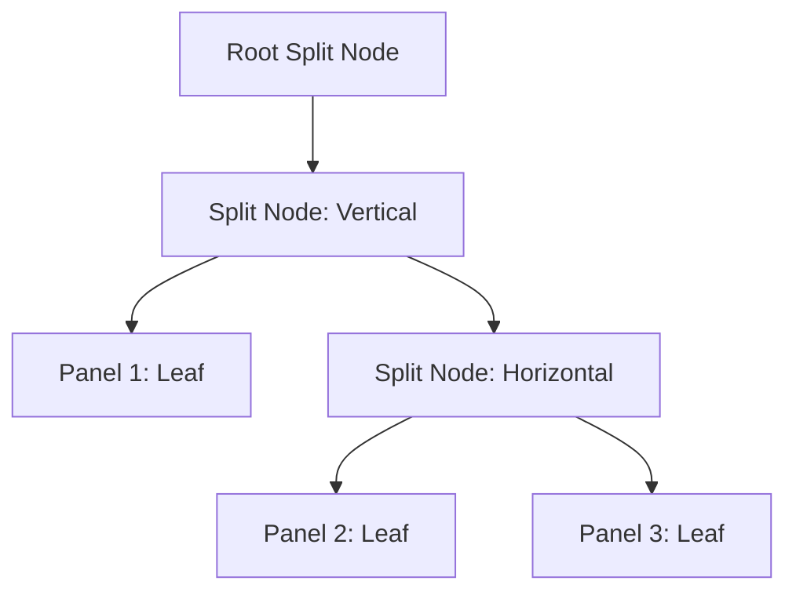

# Colourway

Colourway is a delightful little space to explore the beauty of colour! It's a tiling colour palette explorer that lets you build your own unique visual arrangements. Want more variety? Just add more panels! Feeling minimalist? Remove them! Click on any panel to dive deep into its DNA with HSL, RGB, and Hex values. It's play, experiment, and design all in one.

## Technical Overview

### Design Principles
This project is built with a commitment to simplicity and performance.
- **Pure Web Standards**: Built using only pure HTML5, CSS3, and Vanilla JavaScript.
- **Zero Dependencies**: No external libraries or dependencies are used.

### Architecture

The application employs a recursive binary tree to manage the "dwindling" tiling layout. Each node in the tree is either a leaf node (representing a colour panel) or a split node (representing a spatial division).

*The layout engine dynamically determines split directions (horizontal or vertical) based on the aspect ratio of the parent container to maintain optimal tiling density.*

### External Interfaces

| Interface | Type | Description |
| :--- | :--- | :--- |
| `http://localhost:8080` | Web Interface | Primary user interface accessible via browser. |

### Project Layout

| File | Description |
| :--- | :--- |
| `index.html` | Main entry point and semantic structure. |
| `styles.css` | Tiling layout (Flexbox) and UI styling. |
| `app.js` | Core logic: Tiling engine, state management, and colour conversion. |
| `tests/` | Unit tests for colour math and layout tree integrity. |
| `compose.yaml` | Docker Compose configuration for local development. |

### Architectural Note
The implementation leverages ES Modules to maintain a modular structure. The tiling engine is decoupled from the state management, allowing for predictable layout updates through recursive tree traversal.
